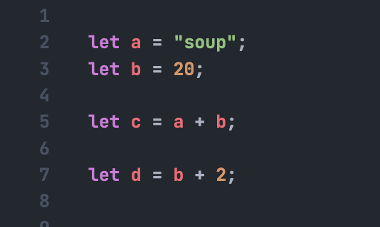
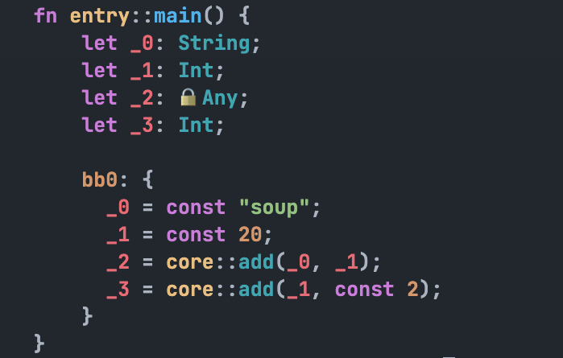

# sea 🌊

**WIP (🚧)**

A dynamic progamming language that transpiles to C.

The goal for sea is to feel like an interpreted language, but with the performance of a compiled language.

This will be achieved by using type inference and user defined types to generate as close to optimal C code as possible.

Types are dynamic by default, and can be inferred by the compiler. However, user's can statically define types for better performance, offloading type checking to the compiler, instead of the runtime.

source --(lexer)-> tokens --(parser)-> ast --(irgen)-> ir --(codegen)-> c

the parser/lexer is at a decent state for now, currently working on the irgen and static passes for the ir.

Basic type inference with generic types currently works.

### example:

IR output

